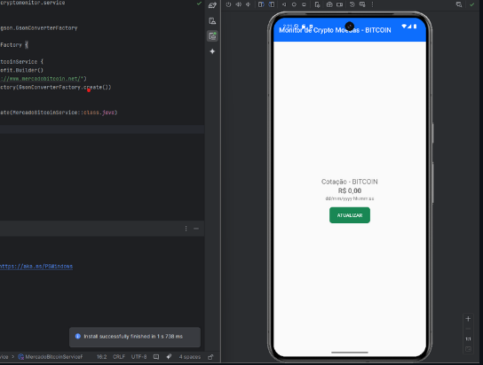
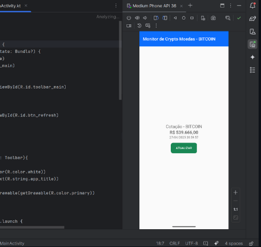

# android-crypto-monitor
O projeto "Android Crypto Monitor" é um aplicativo Android nativo, desenvolvido em Kotlin, que permite o monitoramento de preços de criptomoedas em tempo real, consumindo dados da API pública do Mercado Bitcoin.

Organização do projeto:

pgsql
Copiar
Editar
app/
├── src/main/
│   ├── AndroidManifest.xml
│   ├── java/com/example/cryptomonitor/
│   │   ├── MainActivity.kt
│   │   ├── model/
│   │   │   └── TickerResponse.kt
│   │   ├── service/
│   │   │   ├── MercadoBitcoinService.kt
│   │   │   └── MercadoBitcoinServiceFactory.kt
│   ├── res/
│   │   ├── layout/
│   │   │   └── activity_main.xml
│   │   ├── values/
│   │   │   ├── colors.xml
│   │   │   ├── strings.xml
│   │   │   └── styles.xml
├── build.gradle
└── settings.gradle
A estrutura segue boas práticas de separação de responsabilidades: Activities para lógica de UI, Models para representação de dados e Services para comunicação de rede.

AndroidManifest.xml
O AndroidManifest.xml é o arquivo de configuração principal de uma aplicação Android. Ele descreve componentes da aplicação e define permissões, filtros de intenções, e informações globais.

Principais características no projeto:

Definição da MainActivity:
Estabelece que a MainActivity será a atividade inicial aberta ao lançar o aplicativo.

Tema aplicado:
Utiliza o tema definido em styles.xml para estilizar globalmente a aplicação.

MainActivity.kt
A MainActivity.kt é a classe que gerencia a interface gráfica e as interações de usuário.

Responsabilidades:

Inicializar a UI:
Utiliza ViewBinding para acessar elementos da tela de forma segura e tipada.

Comunicação com o serviço de API:
Usa Retrofit para buscar o preço atualizado da criptomoeda (ex.: Bitcoin).

Tratamento de resposta da API:
Caso o carregamento seja bem-sucedido, atualiza a TextView. Caso contrário, informa erro.

 Service/MercadoBitcoinService.kt
A interface MercadoBitcoinService.kt descreve a chamada HTTP que o aplicativo fará.

Análise:

@GET:
Indica uma requisição HTTP do tipo GET.

@Path("coin"):
O parâmetro coin é dinâmico, ou seja, pode buscar dados de qualquer criptomoeda suportada (BTC, ETH, XRP, etc).

Call<TickerResponse>:
Representa a chamada assíncrona que retornará um objeto do tipo TickerResponse na resposta.

Ponto relevante:
Essa abordagem desacopla a lógica de rede da Activity, promovendo código mais limpo e testável.

Service/MercadoBitcoinServiceFactory.kt
O MercadoBitcoinServiceFactory.kt é o fábrica de serviços Retrofit.

Objetivo:

Configurar Retrofit com a base URL da API.

Definir um conversor (Gson) para transformar JSON em objetos Kotlin.

Criar e fornecer instâncias do serviço de API.

Diretório res/
O diretório res/ agrupa todos os recursos não programáticos usados no app, essenciais para a apresentação gráfica.

Componentes:

layout/activity_main.xml:
Layout principal contendo TextView para exibir o preço da criptomoeda.

values/strings.xml:
Armazena todas as strings usadas no app, facilitando a localização e manutenção.

values/colors.xml:
Define cores personalizadas usadas em componentes de interface.

values/styles.xml:
Define temas e estilos de componentes, promovendo uma aparência consistente.

Importância:
A separação de recursos em XML é uma prática fundamental no Android, pois permite mudanças visuais sem alterar o código-fonte.

Conclusão
O projeto "Android Crypto Monitor" segue boas práticas modernas de desenvolvimento Android:

Separação de responsabilidades: Atividades, Modelos e Serviços estão devidamente isolados.

Uso de Retrofit: Simplifica e padroniza a comunicação com APIs RESTful.

Implementação de ViewBinding: Reduz risco de erros de acesso a views.

Arquitetura escalável: A estrutura atual pode facilmente ser expandida para suportar múltiplas moedas, atualização periódica, gráficos históricos, entre outros.

Este projeto serve como uma excelente introdução a conceitos essenciais de aplicações Android modernas e pode ser a base para projetos mais complexos.

